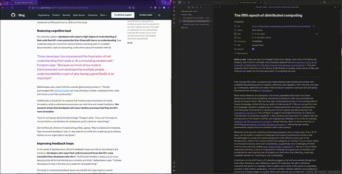

# Slurp

Slurps webpages, cleans off all the crud, and saves them to Obsidian as nice, tidy Markdown files. Think Pocket, but better.



## Goals

* Integrate information from unstructured web pages with the more structured notes, diagrams, and other data managed by Obsidian.
* Make information persistent, indexable, and easier to digest.
* Map out semantic connections between saved pages to encourage reuse and maybe surface unexpected links between ideas.  

## Features

* Use the command palette to create a new note, complete with properties.
* Note properties include properly formatted dates so daily notes link up automatically

## Usage

### Create Note from URL

1. _Ctrl+P_ or _Cmd+P_ to open the command palette
2. Search for _Slurp_
3. Select _Create note from URL_
4. Paste the URL and hit _Enter_ or tap the _Slurp_ button
5. Slurp will save the note to a folder called _Slurped Pages_ and open it up

### Using Bookmarklets or the Browser Extension (Soon™️)

Slurp exposes a custom URI which can be used for one-click saves.

Bookmarklets are a simple option for those who prefer them. Simply create a new bookmark with the following URL set:

```
javascript:(() => document.location.href=`obsidian://slurp?url=${document.URL}`)();
```

Browser extensions are also available for Firefox, Chrome, and other browsers compatible with the standard web extension specification, though they are currently in beta and must be manually installed. See https://github.com/inhumantsar/slurp-extension for details.

### Settings

* `Show empty properties`: Should Slurp add all note properties even if they are empty? (Only affects new notes)

## Known Issues & Limitations

* Social media links generally don't work well, for example:
  * Twitter links will simply fail because Twitter aggressively filters non-browsers.
  * Comments will be captured from HackerNews links (mostly), but all threading will be lost.
  * Reddit links will be processed without error, but only the link, author, and Reddit sidebar content will be captured.
* Slurp does *nothing* to bypass paywalls.
* The conversion will leave a bit of jank behind sometimes, mainly in the form of wonky markup and line breaks.

## Notable Versions

* 0.1.3 - Added mobile support, custom URI for bookmarklets, and the option to show all properties even when empty.
* 0.1.2 - Initial public release

## TODO

* [ ] *IN PROGRESS* Browser extension for one-click slurps
* [ ] Add settings to change the default save location, selectively disable properties, and more
* [ ] Ensure video and other embeds are captured reliably
* [ ] Import Pocket saves, manually and automagically
* [ ] Import bookmarks from other sources, incl browsers
* [ ] LLM summaries and tags
* [ ] Make sure Slurp plays nicely with other plugins, eg Dataview
* [ ] Capture Reddit and Hacker News discussion threads along with the linked page
* [ ] Save PDF and/or HTML versions of the page with the Markdown versions


## Development Environment

### direnv (optional)

There is a `direnv` config which can be used to quickly configure a completely isolated local environment. Setting it up requires a few extra steps though.

1. Install the Nix package manager: `sh <(curl -L https://nixos.org/nix/install) --no-daemon`
2. Ensure `flakes` and `nix-command` are enabled, eg: `mkdir -p ~/.local/nix && echo "experimental-features = nix-command flakes" >> nix.conf`
2. Install `direnv`, adjusting or removing `bin_path` as needed: `curl -sfL https://direnv.net/install.sh | bin_path=~/.local/bin bash`
3. `direnv` will instruct you to add a line to your `.bashrc`, once that's done, run `direnv allow`.

### Building

```
npm install     # not required if using direnv
npm run dev     # enable hot-rebuilds of main.js
```

### Test Vault

[`test-resources/vault`](./test-resources/vault) is an Obisidian vault that can be used for testing. As a side-benefit, it's a place to keep development notes.

There is a symlink in the vault's [plugins directory](./test-resources/vault/.obsidian/plugins/) which uses a relative path to reference the repository root. This may or may not work for you after cloning. Remove and recreate it if Obsidian doesn't see the plugin properly. 

*NOTE*: The plugin won't work (and may not even be recognized) if you haven't [built](#building) the project yet!

### Hot Reload

[Hot Reload](https://github.com/pjeby/hot-reload) is a commonly used plugin for Obsidian plugin development. It will watch for modified plugins and automatically reload it within a running Obsidian instance. It's included in the test vault as a submodule, so you will need to update it on first clone:

```
git submodule update
```

## Testing

### URI Handler

On Linux:

```
xdg-open "obsidian://slurp?url=https://..."
```

## Credits

* [Mozilla's Readability](https://github.com/mozilla/readability) powers the underlying conversion.

## License

[MIT](./LICENSE)