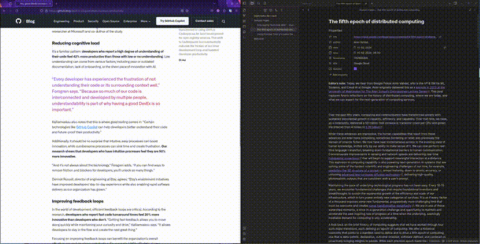

# Slurp

Slurps webpages, cleans off all the crud, and saves them to Obsidian as nice, tidy Markdown files. Think Pocket, but better.

<p style="text-align: center"></p>

# Features

* Slurp pages into Obsidian using the command palette, bookmarklets, or browser extensions (*soon™️*).
* Customize frontmatter properties with formatting options or by adding your own.
* Enrich slurped pages with frontmatter automatically using metadata sources like OpenGraph, including:
  * __Tags__ - Create customizable tags from keywords present on the page. 
  * __Excerpt__ - Often used for subtitles, excerpts, descriptions, and abstracts.
  * __Byline__ - Name of the primary author or the first author detected.
  * __Site name__ - Website or publication name. Useful for blogs and news sites.
  * __Published and Modified dates__
  * __Permalink__
  * __Page type__ - The page type, usually "article", "page", or "post".
  * __Twitter handle__
  * __Onion mirrors__
  * and more...
* Works on desktop and mobile devices.

## New!

- Slurp only the frontmatter, useful for taking notes. Available as a permanent or per-slurp option.
- Share pages with Obsidian from any mobile app and you'll get an option to slurp them.


# Usage

Detailed usage information can be found in the [documentation](https://inhumantsar.github.io/slurp).

## Create Note from URL

1. _Ctrl+P_ or _Cmd+P_ to open the command palette
2. Select _Slurp: Create note from URL_
3. Paste the URL and hit _Enter_ or tap the _Slurp_ button

## Using the "share" function on your device

New in v0.2.0! On Android and iOS devices, you can share web pages with Obsidian. When Obsidian opens it will open a menu containing options for how to handle this URL. Tap the Slurp option and you're done!

## Using Bookmarklets

Slurp exposes a custom URI which can be used for one-click saves.

Bookmarklets are a simple option for those who prefer them. Simply create a new bookmark with the following URL set:

```
javascript:(() => document.location.href=`obsidian://slurp?url=${document.URL}`)();
```

To save only frontmatter for a capture, regardless of the global setting, use:

```
javascript:(() => document.location.href=`obsidian://slurp?url=${document.URL}&frontmatterOnly=true`)();
```

Browser extensions are also coming soon for Firefox and Chrome-compatible browsers. If you want to get started right away, they are currently in beta and can be manually installed. See https://github.com/inhumantsar/slurp-extension for details.

# Settings

## FrontMatter Properties

[Note properties](https://help.obsidian.md/Editing+and+formatting/Properties) are used by Obsidian to add metadata to notes. Supported data types include checkboxes (`true` and `false` values), dates and datetimes, lists, numbers, and good ol' plaintext.

By default, Slurp will try to find relevant metadata and add it to new notes. The plugin settings screen offers a few ways to adjust how this metadata is handled and presented:

* Edit property keys to define what name to use for the metadata.
* Tap the up and down arrows to customize the order in which properties appear in notes.
* Use the *Show empty properties* toggle to get Slurp to add properties even if there is no data to populate them with. 
* Selectively enable/disable individual properties.
* Customize how properties are formatted.
* Add custom properties.

For more information, check out the [documentation](https://inhumantsar.github.io/slurp).

# Beta Testing

If you would like to help test new features before they are officially released:

1. Install [BRAT](https://tfthacker.com/brat-quick-guide#Adding+a+beta+plugin) from the Community Plugins directory
2. Open the command palette and run the command `BRAT: Add a beta plugin for testing`.
  * Do not use a frozen version! I don't tag pre-releases.
3. Enter this repository's URL, ie: `https://github.com/inhumantsar/slurp`.

BRAT will regularly look for updates and install them. This can be configured/disabled in the BRAT settings menu.

# Development Environment

Slurp does a couple things differently from the standard Obsidian plugin development setup:

* Svelte 5 is used to build the property settings component
* The Typescript libraries have been updated to v5.4

If you are a plugin developer already, using a separate environment for Slurp is recommended.

## direnv

There is a `direnv` config which can be used to quickly configure a completely isolated local environment. Setting it up requires a few extra steps though.

1. Install the Nix package manager: `sh <(curl -L https://nixos.org/nix/install) --no-daemon`
2. Ensure `flakes` and `nix-command` are enabled, eg: `mkdir -p ~/.local/nix && echo "experimental-features = nix-command flakes" >> nix.conf`
2. Install `direnv`, adjusting or removing `bin_path` as needed: `curl -sfL https://direnv.net/install.sh | bin_path=~/.local/bin bash`
3. `direnv` will instruct you to add a line to your `.bashrc`, once that's done, run `direnv allow`.

## Building

```
npm install     # not required if using direnv
npm run dev     # enable hot-rebuilds of main.js
```

## Versioning

The usual semantic versioning applies. 

`manifest-beta.json` provides the dev channel specifications for BRAT.

## Test Vault

[`test-resources/vault`](./test-resources/vault) is an Obisidian vault that can be used for testing. As a side-benefit, it's a place to keep development notes.

There is a symlink in the vault's [plugins directory](./test-resources/vault/.obsidian/plugins/) which uses a relative path to reference the repository root. This may or may not work for you after cloning. Remove and recreate it if Obsidian doesn't see the plugin properly. 

*NOTE*: The plugin won't work (and may not even be recognized) if you haven't [built](#building) the project yet!

## Hot Reload

[Hot Reload](https://github.com/pjeby/hot-reload) is a commonly used plugin for Obsidian plugin development. It will watch for modified plugins and automatically reload it within a running Obsidian instance. It's included in the test vault as a submodule, so you will need to update it on first clone:

```
git submodule update
```

# Testing

## URI Handler

On Linux:

```
xdg-open "obsidian://slurp?url=https://..."
```

# Credits

* [Mozilla's Readability](https://github.com/mozilla/readability) powers the underlying conversion.

# License

[MIT](./LICENSE)
