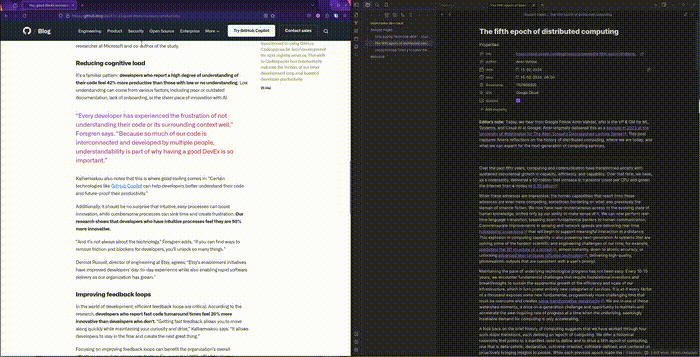
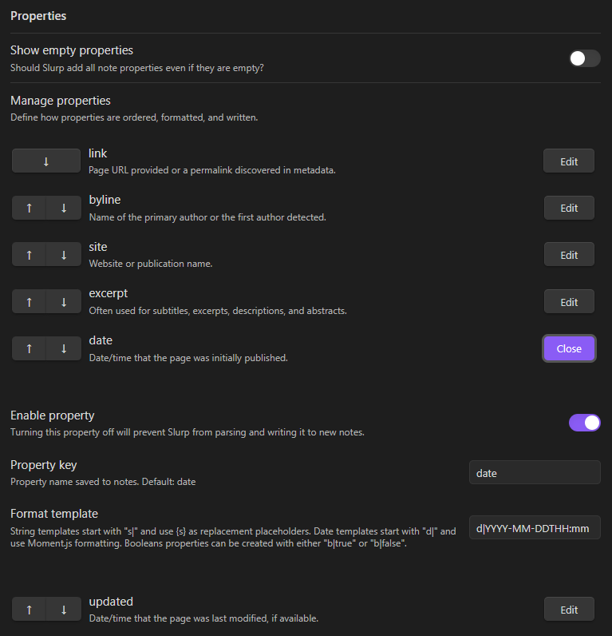
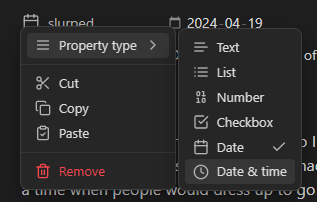

# Slurp

Slurps webpages, cleans off all the crud, and saves them to Obsidian as nice, tidy Markdown files. Think Pocket, but better.

<p style="text-align: center"></p>

# Usage

## Create Note from URL

1. _Ctrl+P_ or _Cmd+P_ to open the command palette
2. Select _Slurp: Create note from URL_
3. Paste the URL and hit _Enter_ or tap the _Slurp_ button

## Using Bookmarklets or the Browser Extension (Soon™️)

Slurp exposes a custom URI which can be used for one-click saves.

Bookmarklets are a simple option for those who prefer them. Simply create a new bookmark with the following URL set:

```
javascript:(() => document.location.href=`obsidian://slurp?url=${document.URL}`)();
```

Browser extensions are also coming soon for Firefox and Chrome-compatible browsers. If you want to get started right away, they are currently in beta and can be manually installed. See https://github.com/inhumantsar/slurp-extension for details.

# Settings

## FrontMatter Properties

<p style="text-align: center"></p>

[Note properties](https://help.obsidian.md/Editing+and+formatting/Properties) are used by Obsidian to add metadata to notes. Supported data types include checkboxes (`true` and `false` values), dates and datetimes, lists, numbers, and good ol' plaintext.

By default, Slurp will try to find relevant metadata and add it to new notes. The plugin settings screen offers a few ways to adjust how this metadata is handled and presented:

* Edit property keys to define what name to use for the metadata.
* Tap the up and down arrows to customize the order in which properties appear in notes.
* Use the *Show empty properties* toggle to get Slurp to add properties even if there is no data to populate them with. 
* Selectively enable/disable individual properties.

### Format Templates

Custom and built-in properties can be formatted using a simple template string. Strings, datetimes, and booleans are currently supported.

Format templates have three main components:

1. _Type identifiers_: The first two characters indicate to Slurp what kind of formatting to use.
2. _Template body_: The rest of the template defines how to format the property.
3. _Replacement placeholders_: These will be replaced with metadata.

Note that, by default, Obsidian will display newly written properties using an existing format (dates in particular) if there are notes which use the same property name. It will also sometimes guess incorrectly at what format to use on new fields. Correcting these issues manually *should* ensure future notes get the new format.

#### Dates & Datetimes

Date format templates start with `d|` and use [Moment.js](https://momentjs.com/docs/#/displaying/) formatting syntax.

* `d|YYYY-MM-DDTHH:mm` ➡️ `2024-04-20T11:05`
* `d|dddd, MMMM Do YYYY, h:mm:ss a` ➡️ `Tuesday, April 20th 2024, 11:05:50 pm`
* `d|[Today is] dddd` ➡️ `Today is Tuesday`
* `d|YY[Q]Q` ➡️ `24Q2`

<p style="float: right"></p>

There are limitations however. 

* Datetimes are naive and will be processed using your timezone by default. If Slurp detects a datetime which doesn't include its own timezone information, it will assume that it is using your local timezone.
* Custom properties can use datetime format templates as well, but they will be populated with the current date/time.
* When in Reading Mode, Obsidian may choose to display a datetime as a date instead. As seen below, this can be changed but it will affect all notes using the same property key.


#### Strings

String format templates can be used to format built-in properties or to provide a default value to custom properties. They start with `s|` and use `{s}` as a replacement placeholder.

* `Jane Doe` ➕ `s|Written by {s}` ➡️ `Written by Jane Doe`
* `poodle` ➕ `s|{s}{s}{s}` ➡️ `poodlepoodlepoodle`
* `@inhumantsar` ➕ `s|https://twitter.com/{s}` ➡️ `https://twitter.com/@inhumantsar`

Some built-in properties allow the use multi-placeholder format templates. These start with `S|` and use named replacement placeholders. For example, the tag property uses `S|{prefix}/{tag}`. This can be customized in the same way as other string format templates with a few limitations:

* The named placeholders are not available in other properties, eg: you can't use `{prefix}` to add the tag prefix to the title property.
* At least one of the named placeholders must be present, eg: `S|{tag}` and `S|{prefix}` are valid, but `S|my static template` is not.
* Properties which use a multi-placeholder template cannot be changed to a single-placeholder format like `s|...{s}...`.
* Multi-placeholder templates cannot be used with custom properties or built-in properties which don't use them by default.

#### Booleans

<p style="float: right"></p>

Boolean templates aren't templates per-se, since booleans can only ever be `true` or `false`. They can be used to provide a default for custom properties though.

For example, if you wanted a checkbox which indicates whether or not you've read a slurped page, you could create a custom property called `read` and set its template to `b|false`. This will ensure that new notes include `read: false` in their front matter.

Obsidian can display booleans as checkboxes, though it may display it as text at first. This can be fixed in Reading Mode by clicking the icon next to the property and changing its type to *Checkbox*.


# Roadmap

## Toward v1

* [x] Add settings to customize and selectively disable properties.
* [x] Improve documentation and project structure.
* [ ] *IN PROGRESS* Browser extension for one-click slurps.
* [ ] *IN PROGRESS* Add setting for default [save location](https://github.com/inhumantsar/slurp/issues/9).
* [ ] Offer tag parsing, tag prefix, and save location options at slurp-time.
* [ ] Import Pocket saves, bookmarks, and more automagically
* [ ] Support for multiple authors in the byline field.
* [ ] Use a bit of custom parsing logic for popular sites to capture better data and tidy up results:
  * [ ] arXiv: Authors, topics, arXiv IDs, dates, and cleaner formatting. Stretch goal: Grab the paper PDF and any code links as well.
  * [ ] Medium: Clean up the author information captured, particularly the links which get spread across multiple lines currently. 

## Beyond v1

* [ ] Ensure video and other embeds are captured reliably
* [ ] Integrate with an LLM to provide summaries and tag recommendations
* [ ] Make sure Slurp plays nicely with other plugins, eg Dataview
* [ ] Save PDF and/or HTML versions of the page with the Markdown versions
* [ ] More custom parsing logic
  * [ ] HackerNews: Map discussion threads to blockquote levels, capture both the HN URL and the article URL, use submitter name in the byline, ensure dates are reliably captured. Stretch goal: Scores, capture article along with the discussion.
  * [ ] Reddit: Literally any actual content, plus everything mentioned for HN.

# Known Issues & Limitations

* Social media links generally don't work well, for example:
  * Twitter links will simply fail because Twitter aggressively filters non-browsers.
  * Comments will be captured from HackerNews links (mostly), but all threading will be lost.
  * Reddit links will be processed without error, but only the link, author, and subreddit sidebar content will be captured.
* Slurp does *nothing* to bypass paywalls.
* The conversion will leave a bit of janky markup behind sometimes, mainly in the form of too many line breaks.

# Changelog

* 0.1.5 - Customization options for properties.
* 0.1.4 - Improve identification of note properties by sourcing them from well-known meta elements.
* 0.1.3 - Added mobile support, custom URI for bookmarklets, and the option to show all properties even when empty.
* 0.1.2 - Initial public release

# Beta Testing

If you would like to help test new features before they are officially released:

1. Install [BRAT](https://tfthacker.com/brat-quick-guide#Adding+a+beta+plugin) from the Community Plugins directory
2. Open the command palette and run the command `BRAT: Add a beta plugin for testing`.
  * Do not use a frozen version! I don't tag pre-releases.
3. Enter this repository's URL, ie: `https://github.com/inhumantsar/slurp`.

BRAT will regularly look for updates and install them. This can be configured/disabled in the BRAT settings menu.

# Development Environment

Slurp does a couple things differently from the standard Obsidian plugin development setup:

* Svelte 5 is used to build the property settings component
* The Typescript libraries have been updated to v5.4

If you are a plugin developer already, using a separate environment for Slurp is recommended.

## Code Style

[The Zen of Python](https://peps.python.org/pep-0020/#the-zen-of-python) is a great styleguide for any language. 

* Beautiful is better than ugly.
* Explicit is better than implicit.
* Simple is better than complex.
* Complex is better than complicated.
* Flat is better than nested.
* Sparse is better than dense.
* Readability counts.
* Special cases aren't special enough to break the rules.
* Although practicality beats purity.
* Errors should never pass silently.
* Unless explicitly silenced.
* In the face of ambiguity, refuse the temptation to guess.
* There should be one-- and preferably only one --obvious way to do it.
* Although that way may not be obvious at first unless you're Dutch.
* Now is better than never.
* Although never is often better than *right* now.
* If the implementation is hard to explain, it's a bad idea.
* If the implementation is easy to explain, it may be a good idea.
* Namespaces are one honking great idea -- let's do more of those!

When it comes to Typescript specifically, I try to follow the guidelines below. Take these with a grain of salt though. I'm still new to Typescript though and I don't have a ton of professional experience with Javascript generally. If any of these are superdumb, please let me know!

* Don't use `@ts-ignore` unless it's absolutely necessary.
* Add interfaces whenever complex data types are passed between functions.
* Prefer interfaces over types.
* Prefix interface names with `I` and type names with `T`.
* Compact structures and anonymous functions are preferred, eg: `map(...)` > `for (...) {}`.
* Descriptive type, function, and variable names are preferred
* 1-3 character names are fine in small scopes, eg: `(k, v) => {...}` and `for (let i in somevar)`.
* KISS: Any function longer than 10-15 lines or with more than 1 or 2 levels of indentation should probably be broken down.
* Lines over 140 characters long should be broken up. 

Also:
* Please don't use Prettier. 

## direnv

There is a `direnv` config which can be used to quickly configure a completely isolated local environment. Setting it up requires a few extra steps though.

1. Install the Nix package manager: `sh <(curl -L https://nixos.org/nix/install) --no-daemon`
2. Ensure `flakes` and `nix-command` are enabled, eg: `mkdir -p ~/.local/nix && echo "experimental-features = nix-command flakes" >> nix.conf`
2. Install `direnv`, adjusting or removing `bin_path` as needed: `curl -sfL https://direnv.net/install.sh | bin_path=~/.local/bin bash`
3. `direnv` will instruct you to add a line to your `.bashrc`, once that's done, run `direnv allow`.

## Building

```
npm install     # not required if using direnv
npm run dev     # enable hot-rebuilds of main.js
```

## Versioning

The usual semantic versioning applies. 

`manifest-beta.json` provides the dev channel specifications for BRAT.

## Test Vault

[`test-resources/vault`](./test-resources/vault) is an Obisidian vault that can be used for testing. As a side-benefit, it's a place to keep development notes.

There is a symlink in the vault's [plugins directory](./test-resources/vault/.obsidian/plugins/) which uses a relative path to reference the repository root. This may or may not work for you after cloning. Remove and recreate it if Obsidian doesn't see the plugin properly. 

*NOTE*: The plugin won't work (and may not even be recognized) if you haven't [built](#building) the project yet!

## Hot Reload

[Hot Reload](https://github.com/pjeby/hot-reload) is a commonly used plugin for Obsidian plugin development. It will watch for modified plugins and automatically reload it within a running Obsidian instance. It's included in the test vault as a submodule, so you will need to update it on first clone:

```
git submodule update
```

# Testing

## URI Handler

On Linux:

```
xdg-open "obsidian://slurp?url=https://..."
```

# Credits

* [Mozilla's Readability](https://github.com/mozilla/readability) powers the underlying conversion.

# License

[MIT](./LICENSE)